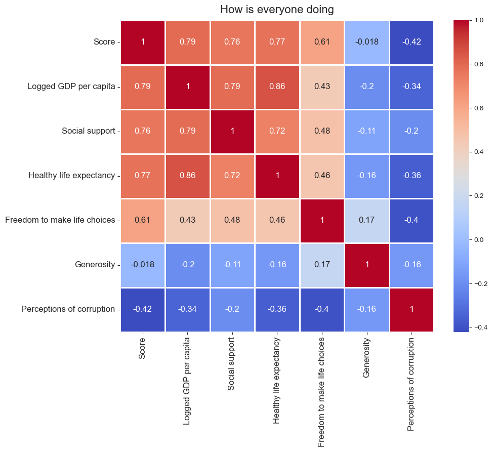

## Table of Contents
1. [Backround & Motivation](#backround--motivation)
2. [Data](#data)
3. [Explatory Data Analysis](#explatory-data-analysis)
4. [Looking Out](#looking-out)

# Backround & Motivation

The World Happiness Report is built on the science of wellbeing, which utilizes qualitative methods to understand how different life experiences influence people's happiness and quality of life. Many researchers and policy-makers believe that the things people find most important in their lives should be a guiding force behind policy design (Cotofan, 2022).

The Data uses the following factors to assess the satisfaction of countries:

1. GDP per Capita: The GDP per capita level of a country.
2. Social Support: The impact of a supportive circle, i.e., the positive impact of friends and family.
3. Healthy Life Expectancy: The average life expectancy.
4.  Freedom to Make Life Choices: The positive impact of freedom and choice.
5.  Generosity: The level of liberality.
6.  Perception of Corruption: Level of trust in the government.

# Data

The [World Happiness Report has a dataset](https://worldhappiness.report) that is gathered from the Gallup World Poll surveys. It asks respondents to think of a ladder, with the best possible life for them being a 10 and the worst possible life being a 0. They are then asked to rate their own current lives on that 0 to 10 scale.

# Explatory Data Analysis
After importing and cleaning the data using pandas, I was curious to see which countries were the happiest and least happiest. Out of the bottom five, four of the countries are in close proximety in South Africa. Afghanistan is noticeably low compared to the other nine countries. Does the 20 year war have a significant impact on the overall health of the country? While the people of Afghanistan are strong, relentless, and fight for a cause, is the Afghan government incompetent because they're corrupt or America's involement has made them soley dependent on America?

The following correlation shows the relation between each other. GDP per capita, Social support, and Healthy life expectancy have the highest correlation with the happiest score. It is noticeable that if a country is doing well economically, there is a strong correlation with living longer. Does that mean money can buy happiness? Let's dive a little deeper.

## Does that mean money can buy Happiness?

The following graph is an average Top 10 GDP per capita score over the 12 years of data provided. If we compare this averaged graph to our Top 5 happiest countries, only Switzerland is on that graph. Although money cannot buy happiness, it can support life.

## What is an impactful contributor to Happiness?

The following graph is an averaged score of the Top 10 Socially Supported countries over 12 years of data provided. If we compare this averaged graph to our Top 5 happiest countries, 4 Countries are on that list. Although our correlation graph concluded money and health have the highest correlation, social support has a  fascinating relation with the the overall *true* happiness.

# Looking Out

I am a believer in attending to our Brother's and Sister's. I was curious to see how the United Nations is doing over the span of 12 years. From an analytical standpoint, we can see some Countries are doing noticeably better than others and the ones struggling have a slight increase in happiness as the years go on. From a united standpoint, we should be engaging and communicating problems and concerns prior to limit negative factors early on.

## Geographically

